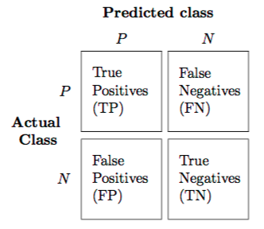

```{r setup, include=FALSE}
library(tidyverse)
knitr::opts_chunk$set(echo = TRUE, message = FALSE, warning = FALSE, collapse = TRUE, fig.align = 'center')
```


## Sobre mi

.pull-left[
- Ingeniero en Informática

- Máster y Doctorado en Informática con énfasis en aprendizaje automático

- Trabajando como ingeniero de aprendizaje automático (antes [ICMAT-CSIC](https://www.icmat.es/), ahora [Komorebi](https://komorebi.ai/))

- Podéis encontrarme en [Linkdin](https://www.linkedin.com/in/albertotb/), [Twitter](https://twitter.com/albertotba) o [Github](https://github.com/albertotb)

- Email: [albertotb@gmail.com](mailto: albertotb@gmail.com) 
]

.pull-right[
.center[


]
]

---

## Contenidos

.pull-left[
1) Conceptos:
  
  - Big data

  - Ciencia de datos (*data science*)

  - Inteligencia Artificial
  
  - Aprendizaje automático (*Machine Learning*)

  
2) Aplicaciones

  - ¿Dónde se está usando actualmente el aprendizaje automático con éxito?
  
  - ¿Dónde no funciona tan bien?

]

.pull-right[
3) Aprendizaje automático

  - Conceptos básicos
  
  - Ejemplos de modelos sencillos
  
    - Regresión lineal
    
    - Regresión logística
    
    - Vecinos próximos
  
4) Demo aplicaciones

5) Foro debate
]

---

class: inverse, middle, center

## ¿Qué es el Big Data?

---

## Big Data

.content-box-red[
.bolder[Big Data]: conjuntos de datos tan grandes y complejos que precisan de aplicaciones informáticas no tradicionales de procesamiento de datos para tratarlos adecuadamente
]

- Definición no muy precisa. **Problemas**:

  - El software evoluciona
  
  - El hardware evoluciona


- Término general (**umbrella term**) para designar cualquier herramienta o aplicación relacionada con el análisis de **datos**

- **Marketing**!: el *big data* está (o estuvo) de moda

---

## ¿Cuánto es grande?

- Según Hadley Wickham (Big Data Pipelines, Febrero 2015), con la capacidad de computación actual:

   1. **Big Data**: no cabe en memoria de un único ordenador (~ Terabytes)

   2. **Medium Data**: cabe en la memoria de un servidor (10 GB – 1 TB)

   3. **Small Data**: cabe en la memoria de un portátil convencional (< 10 GB)
   
--

![:vspace 8]

.content-box-green[
.Large[
Espejismo del **Big Data**: más del 90% de los problemas actuales están en el rango de *small*-*medium* data
]
]

---

## Encuesta: conjunto de datos más grande analizado

.center[


Fuente: KDnuggets. [Largest Dataset Analyzed](https://www.kdnuggets.com/2020/07/poll-largest-dataset-analyzed-results.html)
]

???

La mayoria de aplicaciones no se pueden considerar Big Data

Claramente necesitamos otros conceptos para describir el conjunto de técnicas que se usan para analizar esos conjuntos de datos


---

## El paraguas del **Big Data**

.center[]

- **Machine learning**, **pattern recognition** y **data mining** son prácticamente sinónimos
  
  - Cada uno de los términos fue popular durante diferentes épocas
  
  - Pequeñas diferencias en el énfasis: datos, modelos, aplicaciones 

- **Inteligencia Artificial** es el nuevo término de moda, pero tiene más de 60 años

???

Artificial Intelligence is not Machine Learning

Agents that can sense and interact with the world, learning from the experience. Usually complex systems, that contain more than one machine learning algorithms

Examples: robots, self-driving cars. Many sensors: lidar, cameras, ...


---

## Ciencia de datos (*data science*)

- Campo de estudio que ha ganado mucha popularidad en los últimos 5-10 años

- Todas las organizaciones tienen datos a explotar y estos crecen exponencialmente

- Mezcla de varias disciplinas "tradicionales":

  1. Estadística
  
  2. Matemáticas
  
  3. Ingenieria Informática
  
- Las herramientas se centran en tareas específicas y tienen (todavía) limitaciones: Excel (Microsoft), SPSS (IBM), SAS, Stata, Rapidminer, Weka, BigML

- Lenguajes de programación necesarios para realizar análisis de datos más complejos (Python, R)

---

## Los 6 componentes de la Ciencia de Datos

.pull-left[
1. Recolectar, preparar y explorar datos

2. Representación de los datos y transformación

3. Computación con datos

4. Visualizar y presentar datos

5. Modelado de datos: **machine learning**

6. Ciencia sobre la ciencia de datos
]

.pull-right[
.center[]
]

Fuente: David Donoho. [50 years of Data Science](https://courses.csail.mit.edu/18.337/2015/docs/50YearsDataScience.pdf)

---

## 1. Recolectar y preparar datos

- A veces los datos no están disponibles de forma inmediata y es necesario recolectarlos (por ejemplo encuestas)

- Muchos proyectos se pueden ver beneficiados de añadir todavía más datos: Twitter, clima, conjuntos de datos públicos (censo, etc.)

- Los datos suelen estar en un formato "crudo": 

  - Contienen anomalías, artefactos, etc. que hay que eliminar

- **Muy importante**: explorar los datos y realizar comprobaciones para ver que se cumplen ciertas propiedades e hipótesis básicas


---

## 2. Representación y transformación de los datos

- Los datos a menudo provienen de distintas fuentes y están en formatos diversos: 

  - bases de datos
  
  - hojas de Excel
  
  - *streams* de datos continuos

- Algunos tipos de datos hay que transformarlos en números usando representaciones matemáticas especiales:
  
  - Imágenes
  - Video
  - Audio
  - Sensores
  - Texto

- Conclusión: transformar todas las fuentes a un formato común y unirlas

---

## 3. Computación con datos

- Muchísimas herramientas disponibles en el mercado

- A menudo son necesarios conocimientos de un lenguaje de programación (por ej. R o Python)

- Temas relacionados con la eficiencia computacional

- Múltiples paradigmas para escalar el cómputo a conjuntos de datos masivos:

  1. Computación en la nube
  
  2. Computación en un clúster
  
  3. Computación en paralelo

---

background-image: url(img/big_data_landscape.png)
background-size: contain

---

## 4. Presentación y visualización de datos

.pull-left[
Algunos ejemplos:

- Gráficos para explorar datos

- *Dashboards* para monitorizar procesos de datos

- Visualizaciones para sacar conclusiones de los modelos
]

.pull-right[

]

---

## 5. Modelado de datos

- Tradicionalmente el foco de los programas académicos

- Dos *culturas*:

  1. **Modelado generativo**: asumimos el proceso que genera los datos es conocido, establecer propiedades del mecanismo (estadística)
  
  2. **Modeloado predictivo**: énfasis en predicción, el mundo real es muy complejo y el proceso que genera los datos es desconocido (aprendizaje automático) 

- Más adelante hablaremos de modelos estadísticos sencillos y como aplicarlos en la práctica

---

## 6. Ciencia sobre la ciencia de datos

- Identificar análisis comunes o flujos de trabajo y medir su eficiencia en términos de:

  1. Tiempo
  
  2. Recursos computacionales
  
  3. Validez

- Descubrir patrones emergentes, por ejemplo artefactos en resultados de análisis publicados

- Crear estándares, diseño de herramientas

---


class: middle, inverse, center

# ¿Qué es la Inteligencia Artificial?


???

Es un término que vemos constantemente en los medios de comunicación, por ejemplo:

---

class: inverse, center

.rotate-left[
.border[

]]
--

![:vspace 2]

.rotate-right[
.border[

]
]

--
![:vspace 2]
.rotate-left[
.border[

]
]
--

![:vspace 2]
.rotate-right[
.border[

]
]

???

A que nos referimos con IA?

No estamos hablando de robots con inteligencia similar a la de los humanos

Estamos hablando de algoritmos de aprendizaje automático


---

class:center, middle

.huge[
.content-box-green[
.bolder[Inteligencia artificial]: ordenadores que imitan la inteligencia humana y comportamiento
]
]

.huge[
.content-box-blue[
.bolder[Aprendizaje automático]: conjunto de técnicas que permiten que los ordenadores .bold[aprendan] de forma autónoma
]
]

???

Un robot que interactua con el entorno, toma decisiones yaprende de forma autónoma con nuevas experiencias

Muy probablemente el robot cuenta con sensores que toman imágenes, imitando a los ojos de los humanos

Estas imágenes son procesadas por múltiples algoritmos de aprendizaje automático, por ejemplo para detectar si hay un obstáculo o no

Hay inteligencias artificiales que no tienen nada que ver con aprendizaje automático, por ejemplo una máquina que aprenda a jugar al tres en raya

Si es verdad que en la práctica las aplicaciones más impresionantes de la IA involucran de una forma u otra algoritmos de ML


---

class: center, middle, inverse

# ¿Que significa aprender?

???

en este contexto, que significa aprender?


---

class: center


--

![:vspace 10]


???

Aprender puede ser capaz de distinguir imágenes de gatos

Un ordenador no es capaz de ver la imagen de la misma forma que un humano

Entiende la imágen mediante números, que representan para cada pixel la intensidad de los colores rojo verde y azul 


Lo que hacen estos algoritmos es resolver ecuaciones, que permitan identificar cuando una imágen es de un gato o no

Para ello son necesarias un montón de imágenes con ejemplos gatos, donde sabemos que la ecuación tienen que valer 1, y también imágenes de otros objetos, donde vale 0


---

class: center, middle, inverse

## Aprender: transformar datos en reglas

???

Por tanto, en este tipo de técnicas podríamos decir que aprender (entre comillas) es transformar datos, por ejemplo imágenes, en reglas (que se representan como ecuaciones matemáticas)

Ademas de para detectar gatos, para que se puede usar un sistema como este?

---

## Resumiendo

- De la Wikipedia:

> Machine learning is a subfield of **computer science** that evolved from the study of **pattern recognition** and computational learning theory in artificial intelligence. In 1959, Arthur Samuel defined machine learning as a “Field of study that gives computers the ability to learn without being "**explicitly programmed**". Machine learning explores the study and construction of algorithms that can learn from and make predictions on **data**.

- Es decir:

  - Aprender la relación entre **entradas** y **salidas** a partir de los **datos**, de forma automática

  - Esta relación tiene una **formulación matemática** precisa, se aprenden los **parámetros** de la formulación

  - Nos permite hacer **predicciones** para nuevos datos

---

## Aprendizaje automático vs programación tradicional

1. Programación


2. Aprendizaje automático


.footnote[
[Fuente](https://www.logianalytics.com/predictive-analytics/machine-learning-vs-traditional-programming/)
]

---

class: center, middle


Fuente: [xkcd #1838](https://xkcd.com/1838/)


???

In practice, machine learning borrows heavily from engineering

Lots of trial and error

Software quality has improved a lot in the last years, a novice can train very complex models without deep knowledge of the underlying mathematical formulation

---

class: center, inverse, middle

# Casos de éxito del aprendizaje automático

---

## Sistemas de recomendación

- Los sistemas de recomendación son muy comunes: Netflix, Amazon, Google, ...

  - En 2009 Netflix creó una competición [competition](https://www.netflixprize.com/) para mejorar el rendimiento de su recomendador de películas
  
  - Un equipo de investigadores de AT&T ganó el premio de 1M de dólares

- Más información: [Google](https://sites.google.com/view/understand-ai-ml/success-stories), [Nvidia](https://www.nvidia.com/en-us/deep-learning-ai/customer-stories/)

---

.center[]

---

## Visión por computador

- Los datos que alimentan los algoritmos son imágenes o video (secuencia de imágenes)

- Multiples tareas, se reducen a dos generales:

  1. Detectar objetos dentro de la imágen
  
  2. Clasificar imágenes ([demo de 1993](https://www.youtube.com/watch?v=FwFduRA_L6Q))
  
  .center[]

---

## Detección de objetos


.small[Redmon, J., Divvala, S., Girshick, R., & Farhadi, A. (2016). You only look once: Unified, real-time object detection. In Proceedings of the IEEE Conference on Computer Vision and Pattern Recognition (pp. 779-788).]

---

## Segmentación de objetos


.small[He, Kaiming, Georgia Gkioxari, Piotr Dollár, and Ross Girshick. "Mask R-CNN." In Proceedings of the IEEE International Conference on Computer Vision, pp. 2961-2969. 2017]

---

## Detección de caras


.center[

.footnotesize[[Wikipedia. Face detection](https://en.wikipedia.org/wiki/Face_detection)]
]

---

## Transferencia de estilo

.center[

]

.small[Gatys, Leon A.; Ecker, Alexander S.; Bethge, Matthias. Image style transfer using convolutional neural networks. En Proceedings of the IEEE conference on computer vision and pattern recognition. 2016. p. 2414-2423.]

---

## Colorear imágenes

.center[

]

---

## Coches autónomos

.pull-left[
- Todavía quedan bastantes años para vehículos 100% autónomos

- Existen distintos grados de automatización ya en el mercado:

  - asistencia al aparcar
  
  - detección de cambios de carril
  
  - AutoPilot de Tesla
]

.pull-right[

]

- Problemas importantes como el tráfico denso o condiciones climáticas desfavorables

- Múltiples sensores: cámaras, LiDAR, radar.

- Múltiples algoritmos de aprendizaje automático: en su conjunto probablemente podamos hablar de IA

---

## Generación de imágenes y DeepFakes

  - [ThisPersonDoesNotExist](https://thispersondoesnotexist.com/)
  
.center[


.footnotesize[[Fuente](https://www.businessinsider.com/deepfake-tech-create-fictitious-faces-cats-airbnb-listings-2019-2)]
]

  - [Demo algo más realista](https://www.youtube.com/watch?v=AmUC4m6w1wo)

---

## Análisis de imágenes médicas

  - Ayudar a los médicos a diagnosticar distintas enfermedades a partir de distintas fuentes de datos, por ejemplo imágenes de rayos X
  
  - También se pueden analizar automáticamente otro tipo de imágenes, como microscopia (células)
  
.pull-left[


.footnotesize[[Google AI Blog (2019). Developing Deep Learning Models for Chest X-rays with Adjudicated Image Labels](https://ai.googleblog.com/2019/12/developing-deep-learning-models-for.html)]
]

.pull-right[
    

.footnotesize[[PMFarma (2014). FotoSkin, app gratuita que ayuda al diagnóstico precoz del cáncer de piel](http://www.pmfarma.es/noticias/18574-fotoskin-app-gratuita-que-ayuda-al-diagnostico-precoz-del-cancer-de-piel.html)]
]

---
  
## Procesamiento de lenguaje natural

- Los datos que alimentan los algoritmos son principalmente textos

- Ejemplos de tareas:
    
    - Clasificación de textos
    
    - Análisis de sentimiento
  
    - Generación de textos
  
    - Respuesta de preguntas
    
    - Chatbots
    
    - Traducción automática
    
    - Resumen de textos
  

---

## Respuestas a preguntas

.center[

]


---

## Generación de textos

.pull-left[
- El mayor modelo de lenguaje hasta la fecha es GPT-3 from [OpenAI](https://openai.com/blog/better-language-models/)

  - 175.000 millones de parámetros
  
  - 45 TB de datos  (45,000 GB)

- Microsoft acaba de anunciar una [herramienta](https://1gew6o3qn6vx9kp3s42ge0y1-wpengine.netdna-ssl.com/wp-content/uploads/prod/sites/3/2021/05/GPT-3-Power-Fx-MP4-v2-1.mp4?_=1) basada en GPT-3 que genera fórmulas de Excel a partir de texto natural

- Generación de textos online https://talktotransformer.com/
]

.pull-right[
.center[


.footnotesize[[Fuente](https://www.nytimes.com/2020/11/24/science/artificial-intelligence-ai-gpt3.html)]
]
]


---

## Traducción automática


* [**Google Traslate**](https://ai.google/research/pubs/pub45610)


---

## Reconocimiento de voz

.pull-left[

- Voz a texto

- Texto a voz
]

.pull-right[
- Reconocimiento de locutor

- Clasificación de audio
]


![:vspace1 30]

.pull-left[
.center[

]
]

.pull-right[
.center[


.footnotesize[[Fuente](https://www.theguardian.com/small-business-network/2016/dec/07/shazam-co-founder-we-were-growing-a-business-in-a-collapsing-market)]
]
]


---

## AlphaGo y AlphaFold

  - Programa de ordenador que ganó al juego Go contra Lee Sedol (18 veces campeón del mundo) en 2016

  - Técnicas similares se están usando para descubrir nuevas proteinas

.center[


.footnotesize[[Fuente](https://www.technologyreview.com/2020/11/30/1012712/deepmind-protein-folding-ai-solved-biology-science-drugs-disease/)]
]

---

## Dota2

  - [OpenAI Five](https://openai.com/projects/five/) es un algoritmo que juga a Dota2, un juego de ordenador por equipos (5 vs 5)
  
  - En 2019 ganó 2-0 contra el equipo campeón del mundo de DOTA2
  
  - 99% de victorias contra múltiples equipos amateur

.center[


.footnotesize[[Fuente](https://www.theverge.com/2019/4/13/18309459/openai-five-dota-2-finals-ai-bot-competition-og-e-sports-the-international-champion)]
]


---

## ¿Cuándo no funciona el aprendizaje automático?


En general, la aplicación (exclusivamente) de algoritmos de aprendizaje automático es complicada si:

- No hay relación entre las entradas y salidas

- La aplicación específica presenta problemas éticos

- No hay suficientes datos de calidad disponibles

- No podemos definir una métrica para cuantificar el éxito

- Se necesita una explicación detallada de las decisiones tomadas

- No hay tolerancia para errores

???

- Incluso si hay correlación. Ejemplo: correlación entre venta de helados y ataques de tiburones. Podemos hacer un modelo que prediga los ataques de tiburones? Posiblemente. Es un bueno modelo? Probablemente no

- La idea de confiar en datos y algoritmos más que en nuestro propio juicio tiene pros y contras. Quien tiene la culpa si algo va mal?
  
  - Coches autónomos
  - ML en medicina
  - ML en el sistema judicial
  
- Si el coche autónomo mata a una persona en un accidente, de quien es la culpa

  - Conductor
  - Ingenieros que diseñaron el algoritmo
  - Personas que usaron el algoritmo en ese coche en concreto

- ML funciona muy bien cuando podemos definir el objetivo de forma precisa, aunque no se conozca el proceso para alcanzar dicho objetivo. Métricas específicas a optimizar que capturan bien la solución del problema

- Referencias:
 
 - https://www.getfilecloud.com/blog/2018/06/top-5-limitations-of-machine-learning-in-an-enterprise-setting/
 - https://towardsdatascience.com/the-limitations-of-machine-learning-a00e0c3040c6
 - https://medium.com/mit-initiative-on-the-digital-economy/what-machine-learning-can-and-cannot-do-6788a818776

---

class: center, inverse

.border[
.center[

]
]

--

![:vspace 10]

.border[

]


???

Esta tecnología también conlleva nuevos riesgos que tenemos que anticipar

Por ejemplo, os imaginais lo que podría pasar si el coche no es capaz de detectar un peatón

Esto es lo que paso en 2016 en el primer accidente de un coche autónomo con victimas mortales

En este caso en concreto, el algoritmo no detecto el peatón correctamente

---

background-image: url(img/adversarial.png)
background-size: cover

![:vspace 95]

.tiny[[Thys, Van Ranst, Goedemé (2019). Fooling automated surveillance cameras: adversarial patches to attack person detection](https://arxiv.org/pdf/1904.08653.pdf)]

---

## Sesgos 

- Además de los problemas anteriores, relacionados con errores en el resultado, los modelos de ML pueden amplificar sesgos sociales

- Esto se debe en parte (pero no únicamente) a que replican los sesgos contenidos en los datos

- Si esos algoritmos se usan para tomar decisiones, estarán perjudicando a distintos grupos de población

- A veces estos sesgos pueden pasar desapercibidos porque los modelos no explican con detalle el por qué de sus predicciones

- Ejemplos:
  
  - algoritmo que toma la decisión de conceder un crédito o no
  
  - algoritmo que predice en que zonas se van a cometer más delitos

---

## Más ejemplos

- Modelo que reconstruye imágenes

- Hace que Obama sea blanco (en general, produce caras de personas blancas con más frecuencia)


---

class: center


---

class: inverse, middle, center

# Más ejemplos de aplicaciones

---

Identificar factores de riesgo para el cáncer de próstata

.center[

]

???

clinical measures
lpsa: prostate specific antigen

---

Predecir si una persona va a tener un ataque al corazón basado en variables demográficas, dieta y variables clínicas

.center[]

---

Crear un filtro automático de detección de spam

- Datos de 4601 emails enviados a un empleado de HP labs (George)

- Etiquetados manualmente como .red[spam] o .green[email]

- Objetivo: crear un detector automático de spam

- Datos de entrada: frecuencias relativas de las 57 palabras más frecuentes y signos de puntuación

.center[

]

---

Establecer la relación entre salario y variables demográficas usando datos de encuestas

.center[]

---

Clasificar los píxeles de una imágen satélite por uso de la tierra

.center[]

El color codifica el tipo, por ejemplo *tierra*, *vegetación*, *tierra húmeda*, *uso agrario*, ...

---

class: inverse, center, middle

## Aprendizaje automático en la práctica

---

## Datos

- **Datos en crudo** colección de entidades en su forma natural
  - no se pueden usar directamente en los algoritmos de ML
  
  - ejemplos: texto, imágenes

- **Datos estructurados**:

  - cada fila contiene una muestra o ejemplo
  
  - cada columna representa una variable o caractrística


---

## Aprendizaje supervisado

- Tabla de datos estructurados

- Cada una de las filas tiene asociada una salida o etiqueta

- Los objetivos más comunes son:

  1. **Predecir** el valor de la salida o etiqueta para nuevas observaciones
  
  2. **Entender** la relación entre las variables de entrada y la salida

---

## Tipos de problemas

  1. **Regresión**, si la salida es un número real
  
  2. **Clasificación**, si la salida solo tiene un número discreto de valores posibles
  
    - **binaria**, 2 valores posibles
    
    - **multiclase**, 3 o más valores posibles


  - Existen otras variantes, mezcla de las anteriores
  
  - Algunos problemas se pueden interpretar de varias formas
  
---

## Regresión lineal

Uno de los modelos más sencillos de regresión

.center[

]


---

## Regresión lineal: formulación 

- Si tenemos $d$ variables $x_1$, $x_2$, ..., $x_d$

.center[

]

- La regresión lineal asume que la variable respuesta $y$ depende linealmente de las $x$ $$y = w_0 + w_1x_2 + w_2x_2 + \dots + w_dx_d$$

- El objetivo es estimar los pesos $w$

- Modelo **predictivo**: podemos calcular el valor de $y$ para nuevos valores de $x$

.footnotesize[[Fuente](https://medium.com/from-the-scratch/deep-learning-deep-guide-for-all-your-matrix-dimensions-and-calculations-415012de1568)]

---

## Regresión lineal en 3D

.center[

]

---

## Hipótesis de la regresión lineal

Posibles problemas del modelo:

 * Teóricos: 
   
   1. asumimos que $y$ depende linealmente de $x$
   
   2. asumimos que el modelo está especificado correctamente (no faltan variables)
   
 * Numéricos:
   
   1. hay menos variables que observaciones
   
   2. no hay dos variables con correlación perfecta


???

En los problemas numéricos, en ambos casos hace que la matriz no tenga rango completo y por tanto no podemos calcular la inversa (de forma exacta!!)

---

## ¿Cómo calculamos el valor de los parámetros w?


---

## Minimización del riesgo empírico

* Cuantificar la capacidad predictiva del modelo

* Dadas unas variables $x$, buscamos una función $f(x)$ que se parezca lo máximo posible a $y$

* Definimos una función de pérdida $L(f(x), y)$,

   1. si $f(x)$ e $y$ se parecen, $L$ toma valores pequeños

   2. si $f(x)$ e $y$ son muy distintos, la función devuelve valores grandes
   
* Problema de aprendizaje: encontrar la función $f$ que minimiza la pérdida media para todas las obervaciones $$\hat{f} = \frac{1}{n}\sum_{i=1}^{n}{L(f(x_i), y_i)}$$

---

## Ejemplo

.pull-left[

![:vspace1 30]

| Precio  | Metros cuadrados |
|---------|:----------------:|
| 320,000 | 72               |
| 400,000 | 89               |
| 530,000 | 97               |
| 170,000 | 54               |
| 248,000 | 63               |
]

.pull-right[
.center[

]
]

![:vspace1 10]

- Calcular $w_0$, $w_1$ que minimizan $\sum (y - (w_0 + w_1*x_1))^2$

- El resultado es $w_0 = -240615$ y $w_1 = 7656.2$

- Estimamos el precio para una casa de 80 $m^2$: $y = -240615 + 80 * 7656.2 = 371,881$

- Añadir más variables es directo (si están disponibles)

---

## Calidad del ajuste

La pregunta es, ¿cómo de bien se ajusta la recta a los datos?

.center[

]

---

## Selección de modelos

* Para $L(f(x), y) = (f(x) - y)^2$ esto se conoce como "mínimos cuadrados"

* Para medir la calidad del modelo, podemos calcular la pérdida (error) media en el conjunto de entrenamiento

* **Problema**: este error se puede disminuir de forma casi arbitraria aumentando la complejidad de la clase de funciones

* **Ejemplo**: en el caso de la regresión lineal, podemos añadir nuevas variables que sean expansiones polinómicas de las ya existentes

* Queremos minimizar el **error de generalización**, es decir, el error en nuevas observaciones no usadas para entrenar el modelo


???

* El error de test es una buena aproximación del error de generalización

* Estamos asumiendo que ambos provienen de la misma distribución

* Por tanto, la partición tiene que ser aleatoria

---

## Ejemplo

```{r echo=FALSE, fig.align='center'}
set.seed(1)
n <- 10
x <- seq(0, 1, length.out = n)
y <- 1.5*x - x^2 + rnorm(n, 0, 0.05)
data <- data.frame(x=x, y=y)

x_new <- seq(0, 1, length.out=500)
newdata <- data.frame(x=x_new)

fit1 <- lm(y ~ x + I(x^2), data=data)
fit2 <- lm(y ~ x + I(x^2) + I(x^3) + I(x^4) + I(x^5) 
                 + I(x^6) + I(x^7) + I(x^8) + I(x^9), 
           data=data)
fit3 <- lm(y ~ x, data=data)

y_pred1 <- predict(fit1, newdata=newdata)
y_pred2 <- predict(fit2, newdata=newdata)

ntest <- 1
xtest <- runif(ntest)
ytest <- 1.5*xtest - xtest^2 + rnorm(ntest, 0, 0.05)

plot(data)
lines(x_new, y_pred1, col="blue")
lines(x_new, y_pred2, col="red")
abline(fit3, col="purple")
points(xtest, ytest, col="darkgreen")
legend("bottomright", 
       c(expression(w[0] + w[1]*x), 
         expression(w[0] + w[1]*x + w[2]*x^2),
         expression(w[0] + w[1]*x + w[2]*x^2 + ldots + w[9]*x^9)), 
       lty=1, lwd=1.5, col=c("purple", "blue", "red"), inset=0.04)
```

---

## Conjuntos de entrenamiento y test

* En la práctica, lo primero que hacemos cuando cargamos unos datos es dividirlos aleatoriamente en dos subconjuntos, entrenamiento y test

* El subconjunto de test nos lo guardamos y no se utiliza nunca en la fase de aprendizaje del modelo

* Una vez ajustado el modelo, se comprueba su
rendimiento en el conjunto de test.

* Este error es una buena estimación no sesgada de como se va a comportar nuestro modelo con nuevos datos.

---

## Ejemplo (continuación)

| Precio  | Metros cuadrados | Predicción | Error    |
|---------|:----------------:|:----------:|---------:|
| 320,000 | 72               | 310,631    |  9368.6  |
| 400,000 | 89               | 440,787    | -40786.8 |
| 530,000 | 97               | 502,036    | 27963.6  |
| 170,000 | 54               | 172,820    | -2819.8  |
| 248,000 | 63               | 241,726    | 6274.4   |

![:vspace 5]

- En media, el modelo se equivoca en 17442.64 EUR

- Esa estimación es demasiado optimista

- Tendríamos que reservar algunas viviendas que **no** se usen para calcular el modelo (solo el error)

---

## Equilibrio sesgo-varianza

* El error esperado de un estimador $\hat{f}(X)$ en el punto $x$ (usando pérdida cuadrática) es $$\text{EPE} = \mathbb{E}[(Y - \hat{f}(x))^2]$$

* Podemos descomponerlo en: $$\text{EPE} = \underbrace{\Bigl(\mathbb{E}[\hat{f}(x)] - f(x) \Bigr)^2}_{\text{Sesgo}^2} + \underbrace{E\Bigl[\hat{f}(x) - \mathbb{E}[\hat{f}(x)] \Bigr]^2}_{\text{Varianza}} + \underbrace{\vphantom{\Bigl(}\sigma^2}_{\text{Ruido}}$$

---

class: center, middle


---

## Sobreajuste

* Los términos de sesgo y varianza son opuestos: si disminuimos uno aumenta el otro y viceversa

* El término de ruido es inherente a los datos

* Si el modelo es muy simple, el estimador está sesgado y no se ajusta bien a los datos (infraajuste)

* Si el modelo es demasiado complejo, es muy sensible a pequeñas variaciones en los datos

* Además, el error de test será mucho más alto que el error de entrenamiento (**sobreajuste**)

* **Solución**: encontrar un equilibrio que minimice el error en el conjunto de test

---

class: middle, center


---

## Métricas de regresión

* Valor real muestra $i$, $y_i$

* Estimación del modelo, $\hat{y}_i$

* Error cuadrático medio o *mean squared error* (MSE) $$\text{MSE} = \frac{1}{n}\sum_{i=1}^{n}{(y_i - \hat{y}_i)^2}$$

* Error absoluto medio o *mean absolute error* (MAE) $$\text{MAE} = \frac{1}{n}\sum_{i=1}^{n}{|y_i - \hat{y}_i|}$$

---

## Problemas de clasificación

.center[


Ejemplo de clasificación en 2 dimensiones [Elements of Statistical Learning]
]

---

## Vecinos próximos

* Modelo sencillo que usa las observaciones cercanas a $x$ para realizar la predicción: $$f(x) = \frac{1}{k} \sum_{x_i \in N_k(x)} y_i$$ donde $N_k(x)$ son las $k$ observaciones más cercanas

* Necesaria una métrica (por ej. distancia euclidea)

* Se puede usar tanto para problemas de clasificación como regresión

* Muy sensible al valor de $k$

---

class: center, middle


---

```{r echo=FALSE, message=FALSE, warning=FALSE, fig.align='center'}
library(wSVM)
require(class)
plot_knn <- function(k) {
  x <- mixture.example$x
  g <- mixture.example$y
  xnew <- mixture.example$xnew
  mod15 <- knn(x, xnew, g, k=k, prob=TRUE)
  prob <- attr(mod15, "prob")
  prob <- ifelse(mod15=="1", prob, 1-prob)
  px1 <- mixture.example$px1
  px2 <- mixture.example$px2
  prob15 <- matrix(prob, length(px1), length(px2))
  par(mar=rep(2,4))
  contour(px1, px2, prob15, levels=0.5, labels="", xlab="", ylab="", main=
          paste("Vecinos próximos, k=", k, sep=""), axes=FALSE)
  points(x, col=ifelse(g==1, "coral", "cornflowerblue"))
  gd <- expand.grid(x=px1, y=px2)
  points(gd, pch=".", cex=1.2, col=ifelse(prob15>0.5, "coral", "cornflowerblue"))
  box()
}

plot_knn(15)
```

---

## Métricas de clasificación 

Los principales errores de clasificación se pueden calcular a
partir de la **matriz de confusión**:

.pull-left[

]

.pull-right[
Accuracy: $\frac{\text{TP} + \text{TN}}{\text{P} + \text{N}}$

Sensitivity, recall, TPR: $\frac{\text{TP}}{\text{TP} + \text{FN}}$

Specificity, TNR: $\frac{\text{TN}}{\text{TN} + \text{FP}}$

Precision, PPV: $\frac{\text{TP}}{\text{TP} + \text{FP}}$

F1 score: $2\times \frac{\text{PPV} \times \text{TPR}}{\text{PPV} + \text{TPR}}$
]

---

## Regresión lineal vs vecinos próximos

* La frontera de decisión de la regresión lineal es suave: tiene poca varianza pero potencialmente mucho sesgo

* $k$-vecinos próximos no asume ninguna estructura en los datos: 

    * la frontera de decisión depende localmente solo de los $k$ puntos más cercanos
    
    * tiene poco sesgo pero mucha varianza, ya que es muy inestable

* Elegir un modelo u otro depende de los datos del problema

---

## KNN para regresión


---

## Vecinos próximos: dependencia de $k$


```{r echo=FALSE, message=FALSE, warning=FALSE, fig.align='center'}
plot_knn(1)
```

---

```{r echo=FALSE, message=FALSE, warning=FALSE, fig.align='center'}
plot_knn(5)
```

---

```{r echo=FALSE, message=FALSE, warning=FALSE, fig.align='center'}
plot_knn(50)
```

---

## Selección de hiper-parámetros

* $k$ es un **hiper-parámetro** que controla la complejidad del modelo

* Podemos realizar un argumento similar a la comparación con la regresión lineal:

   * Para $k$ grande, la frontera es más suave pero tiene (potencialmente) mayor sesgo
   * Para $k$ pequeño la frontera es muy inestable (mayor varianza), pero menos sesgo

* Nota: usar el error de entrenamiento para elegir el valor de $k$ es mala idea, para $k=1$ tenemos error 0!!

* Los distintos valores de $k$ se pueden comparar usando el conjunto de test

---

## Conjunto de validación

 * Elegir $k$ como el valor que minimiza error de test $\rightarrow$ error de test ya **no** es una buena estimación del rendimiento del modelo en nuevos datos
 
 * Lo mismo ocurre si elegimos la clase de funciones (modelo) usando el error de test
 
 * **Solución**: crear un tercer conjunto, conjunto de validación, para seleccionar hiper-parámetros y comparar modelos
 
 * Finalmente, reportar el error de test como estimación del poder de generalización del modelo

---

## Validación cruzada

* Se divide el conjunto de entrenamiento en $K$ particiones

* Usar $K-1$ particiones como entrenamiento y la otra como test para ajustar $K$ modelos

* $\hat{f}^{-k}(x)$ es el modelo entrenado con todas las particiones menos la $k$

* Calcular el error de validación cruzada: $$\text{CV}(\hat{f}) = \frac{1}{n}\sum_{i=1}^n{L(y_i, \hat{f}^{-\kappa(i)}(x_i))}$$
donde $\kappa: \{1, \dots, n\} \rightarrow \{1, \dots, K\}$ es una función que indica a que partición pertenece cada observación $i$ 

* Cuando $K = n$ se conoce como validación cruzada *leave-one-out*

???

Tipicos valores para $K$ son 5 o 10
LOOCV el estimador del error de generalizacion es aprox. no sesgado pero puede tener mucha varianza. Tambien es computacionalmente muy costoso

---

class: middle, center


[Fuente](http://ethen8181.github.io/machine-learning/model_selection/model_selection.html)

---

## Regularización

* A menudo se puede reducir la varianza de un estimador a cambio de introducir un pequeño sesgo

* Este término también puede inducir propiedades en la solución, por ej. *sparsity*

* Para ello limitamos la complejidad del modelo añadiendo a la función de pérdida un término de **regularización** $$\min_f\; \{L(y, f(x)) + \lambda J(f)\}$$

* Muchos modelos en aprendizaje automático encajan en este paradigma

---

## Ejemplo

* El estimador de mínimos cuadrados es el mejor estimador no sesgado (mejor = menos varianza)

* Un término de regularización muy habitual es la norma $l_2$: $$||w||^2_2 = w^T w$$

* Junto con la función de pérdida de la regresión lineal, el modelo se conoce como regresión ridge: $$\min_w\; \{(y - \mathbf{X}w)^T (y - \mathbf{X}w) + \lambda w^Tw\}$$


???


BLUE = Best linear unbiased estimator (teorema de Gauss)

Ahora siempre es invertible para $\lambda > 0$

Funcion en R: lm.ridge(), paquete MASS

---

class: inverse, center, middle

# Conclusiones

---

## Resumen

- Incorporar el uso de datos en los procesos de toma de decisión es cada ves más habitual (y solo va a crecer)

- Uno de las herramientas más populares para extraer conocimiento es el **aprendizaje automático** (big data o no)

- Todavía estamos muy lejos de una Inteligencia Artificial General:

  - capaz de razonar y tomar decisiones de forma similar a los humanos
  
  - en múltiples contextos que cambian
  
- Sin embargo, en problemas específicos el aprendizaje automático tiene resultados sorprendentes:

  - .green[Capaz de extraer patrones y crear reglas generales de una ingente cantidad de datos]
  
  - .green[Más rápido y eficiente]
  
  - .red[Incapaz de razonar y explicar sus predicciones]

---

## Referencias

1. Jerome H. Friedman. [Data Mining and Statistics: What's the Connection? (1998)](http://statweb.stanford.edu/~jhf/ftp/dm-stat.pdf)
   
2. Leo Breiman. [Statistical Modeling: The Two Cultures (2001)](http://projecteuclid.org/download/pdf_1/euclid.ss/1009213726)
   
3. Cross Validated. [What is the difference between data mining, statistics, machine learning and AI (2010).](http://stats.stackexchange.com/questions/5026/what-is-the-difference-between-data-mining-statistics-machine-learning-and-ai)
   
4. Sakthi Dasan Sekar. [What is the difference between Artificial Intelligence, Machine Learning, Statistics, and Data Mining (2014)](http://shakthydoss.com/what-is-the-difference-between-artificial-intelligence-machine-learning-statistics-and-data-mining/)
   
5. Cross Validated. [What exactly is Big Data? (2015)](http://stats.stackexchange.com/questions/173060/what-exactly-is-big-data)

6. Pedro Domingos. [A Few Useful Things to Know about Machine Learning (2012)](https://sites.astro.caltech.edu/~george/ay122/cacm12.pdf)

7. David Donoho. [50 Years of Data Science (2017)](https://www.tandfonline.com/doi/pdf/10.1080/10618600.2017.1384734?needAccess=true)